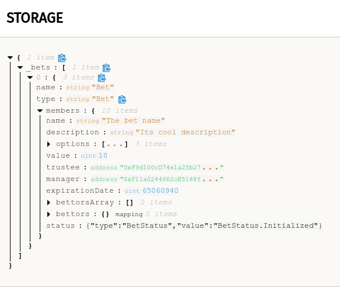

## Set up locally

**Start Ganache**

Install and start Ganache locally.

https://www.trufflesuite.com/ganache

It helps if you go to settings and add the project. It will be able to understand transactions, as well as show contract storage. It will make it easier to understand what happens on the blockchain as it can interpret the transactions and events.


Save and restart Ganache.

**Deploy contracts**

First make sure all dependencies have been installed.

```console
$ npm i
```

To deploy the contracts you need to open a console and run.

```console
$ npx truffle deploy --network=ganache

Compiling your contracts...
===========================
> Everything is up to date, there is nothing to compile.


Starting migrations...
======================
> Network name:    'ganache'
> Network id:      5777
> Block gas limit: 6721975 (0x6691b7)


1_initial_migration.js
======================

   Replacing 'Migrations'
   ----------------------
   > transaction hash:    0x8b68d814db08c8089ca1cf494e9a4530a728956a5d2a76dc34294f0b4198f2f9
   > Blocks: 0            Seconds: 0
   > contract address:    0xA10289F36c05e01AB41E0149Fb149adC0bb7841E
   > block number:        1
   > block timestamp:     1587914771
   > account:             0xF11a0244662cE5188f25238Db12b2De3F9fB22c4
   > balance:             99.99674934
   > gas used:            162533 (0x27ae5)
   > gas price:           20 gwei
   > value sent:          0 ETH
   > total cost:          0.00325066 ETH


   > Saving migration to chain.
   > Saving artifacts
   -------------------------------------
   > Total cost:          0.00325066 ETH


1587913901_trustbet.js
======================

   Replacing 'TrustBet'
   --------------------
   > transaction hash:    0x6d7a9996fef9539f3782424da93b07b0c84823b6ebc71170ac0330b3bd503823
   > Blocks: 0            Seconds: 0
   > contract address:    0x0f6BaCAf10edB81B848d2dD43D700946BDb77a68
   > block number:        3
   > block timestamp:     1587914771
   > account:             0xF11a0244662cE5188f25238Db12b2De3F9fB22c4
   > balance:             99.9612445
   > gas used:            1733326 (0x1a72ce)
   > gas price:           20 gwei
   > value sent:          0 ETH
   > total cost:          0.03466652 ETH


   > Saving migration to chain.
   > Saving artifacts
   -------------------------------------
   > Total cost:          0.03466652 ETH


Summary
=======
> Total deployments:   2
> Final cost:          0.03791718 ETH
```

The contract address is located in `TrustBet` section.

```console
   > contract address:    0x0f6BaCAf10edB81B848d2dD43D700946BDb77a68
```

This is the address you will have to interact with. But it's also visible in Ganache, the contract section.

Once all that is set up and a transaction was sent to the contract, Ganache knows how to interpret it and it can show you useful data.

In the contracts section you will see deployed contracts. You are interested in `TrustBet`.


Clicking on `TrustBet` shows more details, even storage information about the contract.




In the screenshot above you can see a new bet was created and its properties. One can explore bettors, options, or its status.

Below the storage details, one can see transactions that were sent to this contract.

And the last section is events emitted by the contract.
